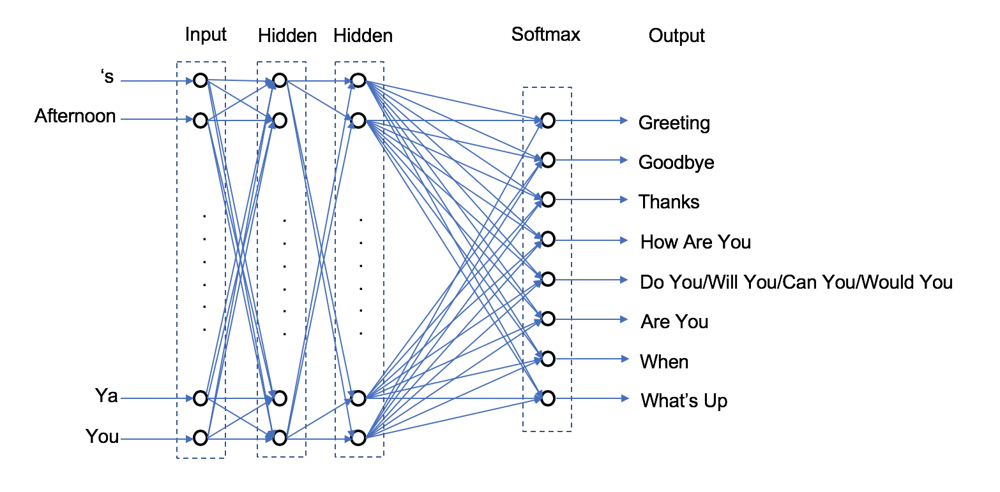

# Reply Bot

Smart reply bot implemented in Python.

## What Does It Do?

The objective of this project is to create a bot that suggests short responses to a text or email message using Natural Language Processing. A reply bot is a type of chatbot. The goal of a chatbot is to mimic written or spoken speech as to simulate a conversation with a human.

The scope of bot is casual conversation.

From a high-level, there are two variants of chatbots, **rule-based** and **self-learning**:
* A **rule-based** bot responds via pattern matching and rules.
* A **self-learning** bot responds via using machine learning.
    * A **retrieval-based** chatbot replies by locating the best response from a database (corpus).
    * A **generative-based** chatbot use deep learning methods to respond and can generate a response it has never seen before.

In order to understand the tradeoffs between the different types of chatbots, I implemented a rule-based, a retrieval-based and a machine learning-based reply bot.

## Built With

* Python
* [NLTK](https://www.nltk.org/)
* TensorFlow and TFLearn

## Design

### Rule-Based Bot

A rule-based chatbot is the simplest type of bot. This type of bot searches for predefined patterns in the input and uses a set of rules (if-else logic) to suggest replies. The suggested replies, in this case, are predefined. We can implement pattern matching on an input message by using regular expressions and applying rules with if-else statements.

For example, to search for a greeting we can use this as our regex pattern:

```python
greeting_str = 'hi|hello|sup|hey|good\s+[morning|afternoon|evening]
```

If the pattern is found, we suggest predefined greeting responses:

```python
greeting_response = ["hi", "hey", "hello"]
```

Altogether we have

```python
if re.search(greeting_str, user_input):
    return greeting_response
```

For the reply bot, I have defined 8 simple rules:
* Greeting
* Goodbye
* How are you
* Thank you
* Do you/will you/can you/would you
* Are you
* When
* What’s up

Each rule has an associated reply:

```python
greeting_response = ["hi", "hello", "hey"]
goodbye_response = ["bye", "talk to you later"]
thank_response = ['happy to help','don\'t mention it','my pleasure']
inquiry_response = ['i\'m doing ok','ok','i\'ve been better']
future_response = ['yes','no','maybe']
what_you_response = ['nothing', 'not much']
are_you_response = ['yes','no', 'maybe']
when_response = ['soon','not now']
no_response = ['[No Suggestion]']
```

### Retrieval-Based Bot

The goal of a retrieval bot is to find the most likely response r given the input i. A retrieval-based bot responds to input using a database of utterance-response (Q-R) pairs. The database is known as our corpus. To generate a response, we first need to classify the user input to one of our predefined classes (if applicable). Once classified, the response associated with that class is suggested.

Below is our database/corpus (in this case, it’s a python dictionary) which we will use for our self-learning bots.

```python
classes_dict = {}

classes_dict["greeting"] = {}
classes_dict["greeting"]["pattern"] = ["hi there", "hello", "hey", "good afternoon", "good morning", "good evening", "good day"]
classes_dict["greeting"]["response"] = ["hi", "hey", "hello"]

classes_dict["goodbye"] = {}
classes_dict["goodbye"]["pattern"] = ["bye", "goodbye", "see you later", "gotta go", "i have to go", "see you", "see ya", "talk to you later"]
classes_dict["goodbye"]["response"] = ["bye", "talk to you later"]

classes_dict["thanks"] = {}
classes_dict["thanks"]["pattern"] = ["thanks", "thank you"]
classes_dict["thanks"]["response"] = ["you're welcome", "my pleasure", "don't mention it"]

classes_dict["how are you"] = {}
classes_dict["how are you"]["pattern"] = ["how are you", "how are you doing", "how's it going"]
classes_dict["how are you"]["response"] = ["i'm doing ok", "ok", "i've been better"]

classes_dict["future"] = {}
classes_dict["future"]["pattern"] = ["will you", "can you", "would you", "do you"]
classes_dict["future"]["response"] = ["yes", "no", "maybe"]

classes_dict["are you"] = {}
classes_dict["are you"]["pattern"] = ["are you", "aren't you"]
classes_dict["are you"]["response"] = ["yes", "no", "maybe"]

classes_dict["when"] = {}
classes_dict["when"]["pattern"] = ["when will", "when can", "when would", "when should"]
classes_dict["when"]["response"] = ["soon", "not now"]

classes_dict["whats up"] = {}
classes_dict["whats up"]["pattern"] = ["sup", "what's up", "what up", "whats up", "what is going on", "what's going on", "what's happening", "what are you up to", "what are you doing"]
classes_dict["whats up"]["response"] = ["nothing", "not much"]
```

It can be seen that we have the 8 classes to classify user input. Each value of classes_dict (i.e., “greeting”, “goodbye”, etc.), has sub-dictionaries of “pattern” and “response.” “pattern” defines a list of expressions that we use to match user input to that class. “response” defines the suggested responses when a match to that class has been found.

For a retrieval-based bot, to determine the class of the user input, we do not use pattern matching but instead deconstruct the user input into a feature vector via text processing [4]. Basic text pre-processing includes:

* Converting text into uppercase or lowercase
* Tokenizing – convert normal text strings into a list of tokens
* Removing noise – remove everything that isn’t a number or letter (i.e. punctuation)
* Stemming – reduce words to their stem, base or root form
* Lemmatization – a variant of stemming. Stemming can create non-existent words; however, lemmas are actual words. For example, the words “better” and “good” are the same lemma [5]
* Removing stop words – remove extremely common words that would be of little value to the algorithm

Once the user input is pre-processed, we transform the user input into a vector of numbers (one number for each word). We do this using Term Frequency-Inverse Document Frequency (TF-IDF). This assigns a weight to each word which is a statistical measure about how important that word is. We can then use cosine similarity to compare user input to the corpus [1]:

```python
remove_punct_dict = dict((ord(punct), None) for punct in string.punctuation)

def lem_tokens(tokens):

    lemmer = nltk.stem.WordNetLemmatizer()

    return [lemmer.lemmatize(token) for token in tokens]

def lem_normalize(text):

    return lem_tokens(nltk.word_tokenize(text.lower().translate(remove_punct_dict)))

sent_tokens['user'] = user_input
sent_tokens_ = []

for value in sent_tokens:
sent_tokens_.append(sent_tokens[value])

tfidf_vec = TfidfVectorizer(tokenizer = lem_normalize)
tfidf = tfidf_vec.fit_transform(sent_tokens_)
vals = cosine_similarity(tfidf[-1], tfidf)
idx = vals.argsort()[0][-2]
flat = vals.flatten()
flat.sort()
req_tfidf = flat[-2]
```

The class with the highest similarity to the user input is chosen and the class response is suggested.

```python
error_threshold = 0.1
if(req_tfidf < error_threshold):

    robo_response = ["[No Suggestion]"]

else:

    for value in sent_tokens:
        match_pattern = sent_tokens_[idx]
        pattern = sent_tokens[value]
        if match_pattern == pattern:
            match_class = value

    robo_response = my_dict[match_class]['response']

```

### Machine Learning-Based Bot

This type of reply bot uses a Neural Network (NN) to suggest a reply. The NN classifies the user input into one of pre-defined classes and we suggest the replies associated with that class [2].

The first step to creating input training data is to create an array of words found in our corpus, which we call our ‘bag of words.’ Recall all the class patterns found in the corpus:

```python
classes_dict["greeting"]["pattern"] = ["hi there", "hello", "hey", "good afternoon", "good morning", "good evening", "good day"]
classes_dict["goodbye"]["pattern"] = ["bye", "goodbye", "see you later", "gotta go", "i have to go", "see you", "see ya", "talk to you later"]
classes_dict["thanks"]["pattern"] = ["thanks", "thank you"]
classes_dict["how are you"]["pattern"] = ["how are you", "how are you doing", "how's it going"]
classes_dict["future"]["pattern"] = ["will you", "can you", "would you", "do you"]
classes_dict["are you"]["pattern"] = ["are you", "aren't you"]
classes_dict["when"]["pattern"] = ["when will", "when can", "when would", "when should"]
classes_dict["whats up"]["pattern"] = ["sup", "what's up", "what up", "whats up", "what is going on", "what's going on", "what's happening", "what are you up to", "what are you doing"]
```

We tokenize, stem, and sort these patterns to create an a bag of words array. We have 42 known words in our corpus:

```python
my_words = ["'s", 'afternoon', 'ar', 'bye', 'can', 'day', 'do', 'doing', 'ev', 'go', 'going', 'good', 'goodby', 'got', 'hap', 'hav', 'hello', 'hey', 'hi', 'how', 'i', 'is', 'it', 'lat', 'morn', "n't", 'on', 'see', 'should', 'sup', 'ta', 'talk', 'thank', 'ther', 'to', 'up', 'what', 'when', 'wil', 'would', 'ya', 'you']
```

Likewise, we need to create a sorted array for our output classes:

```python
my_classes = ['are you', 'future', 'goodbye', 'greeting', 'how are you', 'thanks', 'whats up', 'when']
```

We now can create our training data. Let’s use the ‘how are you’ class as an example.

```python
classes_dict["how are you"]["pattern"] = ["how are you", "how are you doing", "how's it going"]
```

In this class, one pattern is ‘how are you doing.’ We can tokenize and stem this into a list:

```python
my_pattern = ['how', 'ar', 'you', 'doing']
```

We then create an input training list by appending a 1 in indices where a my_pattern word is found in our list of known words (my_words) and appending a 0 otherwise. For the pattern ‘how are you doing,’ we append bag with a 1 in positions ‘ar’ ‘doing’, ‘how,’ and ‘you’:

```python
bag = [0, 0, 1, 0, 0, 0, 0, 1, 0, 0, 0, 0, 0, 0, 0, 0, 0, 0, 0, 1, 0, 0, 
0, 0, 0, 0, 0, 0, 0, 0, 0, 0, 0, 0, 0, 0, 0, 0, 0, 0, 0, 1]
```

Since this belongs to the ‘how are you’ class, we append the output as

```python
output_row = [0, 0, 0, 0, 1, 0, 0, 0]
```

The architecture of our NN is simple, as can be seen below. We have only 2 hidden layers.



We train this for 1,000 epochs; this actually trains quite fast. It takes less than 30 seconds to train completely.

Once the model is trained, we can use the model to predict a class on user input. Again we define an error threshold for when to offer a response. Here it is 95%. Instead of using and error threshold to determine if a message will get a smart reply, we could train/implement a binary classifier on all messages to determine if they will get a smart reply [1].

```python
def tokenize_input(sentence):

    sentence_words = nltk.word_tokenize(sentence) # tokenize pattern

    for some_word in sentence_words:
        sentence_words[sentence_words.index(some_word)] = stemmer.stem(some_word.lower())

    return sentence_words

def bag(user_input):

    input_words = tokenize_input(user_input)

    bag = [0] * len(my_words)

    for input_word in input_words:
        for i in range(0,len(my_words)):
            bag_word = my_words[i]
            if input_word == bag_word:
                bag[i] = 1
                
    return(np.array(bag))
    
error_threshold = 0.95
def classify(user_input):
                
    results = model.predict([bag(user_input)])[0] # generate probabilities from the model
                
    filtered_results = []
                
    for i in range(0, len(results)):
            this_result = results[i]
            if this_result > error_threshold:
                filtered_results.append([i, this_result])
                
    filtered_results.sort(key = lambda x: x[1], reverse = True)
                
    return_list = []
                
    for i in range(0, len(filtered_results)):
        return_list.append((my_classes[filtered_results[i][0]], filtered_results[i][1]))
                
    return return_list # return tuple of intent and probability

some_array = classify(user_input)

if len(some_array) != 0:

    for response in classes_dict[some_array[0][0]]["response"]:
        print "* " + response
```

## Usage

Execute the program

```
python rule_based_reply.py
```

The program will then request a message

```
* Hello! Type in a message and I will suggest some replies! If you'd like to exit please type quit!
>>>
```

Try different different messages and the reply bot will generate suggested replies or [No Suggestion]

```
>>> hello
* hi
* hey
* hello
```

To quit, type quit

```
>>> quit
```

## Thoughts

It's obvious that no one type of reply bot works best. A retrieval-based bot performs poorly for casual conversation and works better for factual queries. For casual conversation, a hybrid implementation (rule-based and machine-learning based) may work best.

## Author

**Laura Kocubinski** [laurakoco](https://github.com/laurakoco)

## Acknowledgments

* Boston University MET Master Science Computer Science Program
* MET CS 664 Artificial Intelligence

[1] https://medium.com/analytics-vidhya/building-a-simple-chatbot-in-python-using-nltk-7c8c8215ac6e

[2] https://chatbotsmagazine.com/contextual-chat-bots-with-tensorflow-4391749d0077 
